# How is the Gradient Map Created?

Zooming into the Northern Alps and tracing the contour lines brings back a mix of curiosity and half-forgotten memories from past trips — where exactly was the Rappenseehütte? Which ridge did we cross to get there? What was the name of that valley?

The same questions come up when cycling through Stuttgart, where every route is shaped by the terrain beneath it.

In this article, I want to explore how elevation data works under the hood — what it takes to encode the shape of the Earth into something a browser can render, and how we can turn that data into a useful visualisation.

## Table of Contents

- [Introduction](#introduction)
- [Requirements for the Elevation Profile](#requirements-for-the-elevation-profile)
  - [Encoding Elevation](#encoding-elevation)
    - [How many bits do we need?](#how-many-bits-do-we-need)
    - [Reference Points on the Elevation Scale](#reference-points-on-the-elevation-scale)
  - [Encoding Location](#encoding-location)
    - [A Brief History](#a-brief-history)
    - [Latitude and Longitude](#latitude-and-longitude)
    - [How Precise Can Coordinates Be?](#how-precise-can-coordinates-be)
    - [Bit Requirements for Coordinates](#bit-requirements-for-coordinates)
- [Unterstanding Map Tiles - Terrarium](#the-web-map-tile-architecture)
  - [The Trick: Elevation Encoded in Pixels](#the-trick-elevation-encoded-in-pixels)
    - [How Terrarium Decodes RGB into Elevation](#how-terrarium-decodes-rgb-into-elevation)
    - [Key Reference Points](#key-reference-points)
    - [Worked Example: Stuttgart](#worked-example-stuttgart)
  - [Tiles and Zoom Levels](#tiles-and-zoom-levels)
    - [Zoom 0 — The Whole World in One Tile](#zoom-0--the-whole-world-in-one-tile)
    - [Zoom 1 — The World in Four Tiles](#zoom-1--the-world-in-four-tiles)
    - [Ground Resolution per Zoom Level](#ground-resolution-per-zoom-level)
    - [What is an Arc-Second?](#what-is-an-arc-second)
  - [Finding the Right Pixel: Latitude & Longitude to Tiles](#finding-the-right-pixel-latitude--longitude-to-tiles)
    - [The Math](#the-math)
    - [Example Visualization Tile - Stuttgart](#example-visualization-tile---stuttgart)
    - [From Tile to Exact Pixel](#from-tile-to-exact-pixel)
- [Apply It](#apply-it)
- [References](#references)

---

## Introduction

It all starts with NASA's Digital Elevation Model (DEM): a product of several air and space missions — most notably the Shuttle Radar Topography Mission (SRTM) — that mapped nearly the entire Earth's surface. The result is a global grid where every cell stores a single value: *how many meters above sea level is this point?* Originally built to support ecological conservation, wildfire planning, and flood risk modelling, this dataset has since become a foundation for countless mapping applications. ([NASA Earth Data](https://www.earthdata.nasa.gov/topics/land-surface/digital-elevation-terrain-model-dem))


## Requirements for the Elevation Profile

### Encoding Elevation

To represent terrain digitally, we need to cover the full range of Earth's surface — from the deepest ocean trench to the highest mountain peak:

- Mount Everest   — 8,849 m above sea level (highest point)
- Challenger Deep — 10,994 m below sea level (deepest point)

For metre-accurate resolution, the encoding must span a total range of 19,843 m (8,849 + 10,994). Since depths are negative, we need a signed representation.

#### How many bits do we need?

| Bits (n) | Unsigned (2ⁿ) | Signed (±2ⁿ⁻¹) |
|---|---|---|
| 12 | 4,096 | 2,048 |
| 13 | 8,192 | 4,096 |
| 14 | 16,384 | 8,192 |
| 15 | 32,768 | 16,384 ← covers Challenger Deep |
| 16 | 65,536 | 32,768 ← Room for more and alignment with standard byte boundary |
| 17 | 131,072 | 65,536 |
| 18 | 262,144 | 131,072 |
| 19 | 524,288 | 262,144 |
| 20 | 1,048,576 | 524,288 |
| 21 | 2,097,152 | 1,048,576 |
| 22 | 4,194,304 | 2,097,152 |
| 23 | 8,388,608 | 4,194,304 |
| 24 | 16,777,216 | 8,388,608 |
| 32 | 4,294,967,296 | 2,147,483,648 |

A signed 15-bit integer covers ±16,384 m — just enough to represent Challenger Deep. In practice, 16 bits (2 bytes) is the better choice: it provides comfortable headroom and aligns with standard byte boundaries.

#### Reference Points on the Elevation Scale

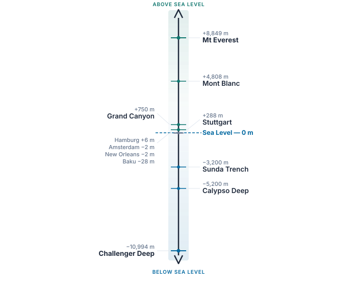

| Location | Elevation |
|---|---|
| Mt Everest | +8,849 m |
| Mont Blanc | +4,808 m |
| Grand Canyon (Phantom Ranch) | +750 m |
| Stuttgart | +288 m |
| Hamburg | +6 m |
| Sea level | 0 m |
| Amsterdam | −2 m |
| New Orleans | −2 m |
| Baku | −28 m |
| Sunda Trench | −3,200 m |
| Calypso Deep | −5,200 m |
| Mariana Trench (Challenger Deep) | −10,994 m |


### Encoding Location

Elevation tells us how high a point is — but we also need to know where it is. The most widely used system for pinpointing any location on Earth is latitude and longitude.

#### A Brief History

The Prime Meridian (0° longitude) was fixed at the Royal Observatory in Greenwich, London, by international agreement in 1884. At the time, Britain was the dominant naval and cartographic power, and their observatory became the global reference point. Angles are measured counter-clockwise from this line — eastward is positive — matching the direction of Earth's rotation.

#### Latitude and Longitude

Latitude measures how far north or south a point lies from the equator:

- Equator = 0°
- North Pole = +90°
- South Pole = −90°

Longitude measures how far east or west a point lies from the Prime Meridian:

- Prime Meridian = 0°
- Eastward = positive, up to +180°
- Westward = negative, down to −180°

For example, Stuttgart sits at 48.7758° N, 9.1829° E — roughly halfway between the equator and the North Pole, and slightly east of London.

#### How Precise Can Coordinates Be?

The precision of a coordinate depends on how many decimal places we use. To calculate the ground distance represented by a given angular resolution, we model the Earth as a sphere with radius R = 6,371 km and apply:

> x = R × sin(Δ°)

| Decimal places | Angular step | Ground distance | Typical use |
|---|---|---|---|
| 4 | 0.0001° | 11.12 m | Consumer GPS |
| 5 | 0.00001° | 1.11 m | Modern dual-frequency phones |
| 6 | 0.000001° | 0.11 m (11 cm) | Military GPS (PPS / M-code) |

For consumer-grade applications, four decimal places (≈ 11 m) is the practical limit. Military GPS achieves roughly 30 cm accuracy using encrypted dual-frequency signals and can reach 10 cm with differential corrections (DGPS).

#### Bit Requirements for Coordinates

At four-decimal-place precision (0.0001°), how many distinct values do we need?

| Axis | Range | Distinct values | Bits required |
|---|---|---|---|
| Latitude | −90° to +90° (180°) | 1,800,000 | 21 bits |
| Longitude | −180° to +180° (360°) | 3,600,000 | 22 bits |


## Unterstanding Map Tiles - Terrarium

With the requirements established above, every point on Earth's surface needs three values:

| Field | Bits |
|---|---|
| Latitude | 21 |
| Longitude | 22 |
| Elevation | 16 |
| Total | 59 bits ≈ 8 bytes per point |

At consumer GPS resolution, a global grid would contain roughly 6.5 billion points (1.8 M × 3.6 M). At 8 bytes each, that amounts to approximately 52 GB of raw data — far too large to serve directly over the web.

So how do we make this practical?

### The Trick: Elevation Encoded in Pixels

Rather than transmitting raw coordinate-elevation tuples, the data is sliced into a grid of 256 × 256 pixel PNG tiles — the same tile system (`z/x/y`) that web maps already use for street and satellite imagery.

Each tile covers a fixed geographic region, so the latitude and longitude are implicit from the tile's position in the grid. That eliminates 43 of the 59 bits entirely. Only the elevation needs to be stored — and it is encoded directly into the pixel's colour channels.

A normal image uses Red, Green, and Blue to represent colour. Terrarium tiles repurpose these three channels to store a number instead.

#### How Terrarium Decodes RGB into Elevation

Lets have a closer look how Terrarium calculates it

```
Elevation = (R × 256 + G + B / 256) − 32768
```

Terrarium's decoding formula is a polynomial, the same mathematical concept used to convert decimal numbers to hexadecimal. The only difference is that Terrarium uses base 256:
```
Elevation = R × 256¹  +  G × 256⁰  +  B × 256⁻¹  −  32768
```
The history of polynomial equations traces back to [Euclid](https://de.wikipedia.org/wiki/Elemente_(Euklid)) and [François Viète](https://de.wikipedia.org/wiki/Fran%C3%A7ois_Vi%C3%A8te).

Compare this to how binary (base 2) represents the number 6:

```
1 × 2²  +  1 × 2¹  +  0 × 2⁰  =  6
```

The only difference is the base. In Terrarium, each "digit" is a byte (0–255), so the base is 256.

#### Key Reference Points

| R | G | B | Elevation | Meaning |
|:---:|:---:|:---:|---:|:---|
| 0 | 0 | 0 | −32,768 m | Minimum (deepest encodable) |
| 128 | 0 | 0 | 0 m | Sea level |
| 255 | 255 | 255 | +32,767 m | Maximum (highest encodable) |

#### Worked Example: Stuttgart

With R = 129, G = 214, B = 0:

```
R × 256¹  +  G × 256⁰  +  B × 256⁻¹  =  33238.0
                                − 32768  =  470.0 m
```

When viewed in an image editor, a Terrarium tile looks like abstract pastel noise — because it is not meant to be seen. It is meant to be decoded.

### Tiles and Zoom Levels

Terrarium divides the surface of the Earth into square tiles, organised by zoom level. At zoom 0, the entire world fits into a single tile. Each higher zoom level doubles the resolution in both directions.

#### Zoom 0 — The Whole World in One Tile

<div style="display:flex;gap:16px;align-items:flex-start;margin:1.5rem 0;">
<div style="text-align:center;">
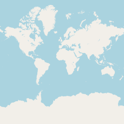
<div style="font-size:0.85rem;color:#64748b;margin-top:4px;">OpenStreetMap — z0/0/0</div>
</div>
<div style="text-align:center;">
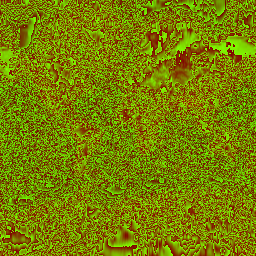
<div style="font-size:0.85rem;color:#64748b;margin-top:4px;">Terrarium (elevation) — z0/0/0</div>
</div>
</div>

The OSM tile shows the familiar world map. The Terrarium tile encodes the same geography as colour values — mountain ranges appear as brighter bands, oceans as uniform dark regions.

#### Zoom 1 — The World in Four Tiles

At zoom 1, the world is split into a 2×2 grid. Each tile covers a quarter of the globe.

<div style="display:flex;gap:32px;align-items:flex-start;flex-wrap:wrap;margin:1.5rem 0;">
<div style="text-align:center;">
<div style="display:grid;grid-template-columns:1fr 1fr;gap:2px;width:258px;margin:0 auto;">
<div>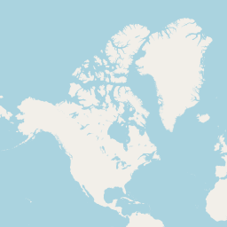</div>
<div>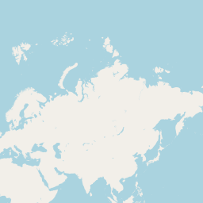</div>
<div>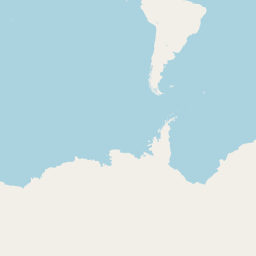</div>
<div>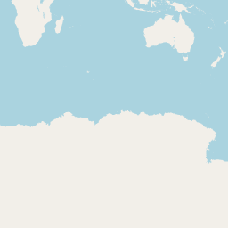</div>
</div>
<div style="font-size:0.85rem;color:#64748b;margin-top:4px;">OpenStreetMap — Zoom 1 (2×2)</div>
</div>
<div style="text-align:center;">
<div style="display:grid;grid-template-columns:1fr 1fr;gap:2px;width:258px;margin:0 auto;">
<div>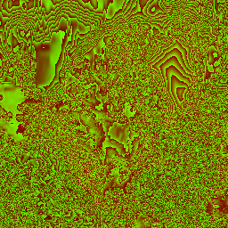</div>
<div>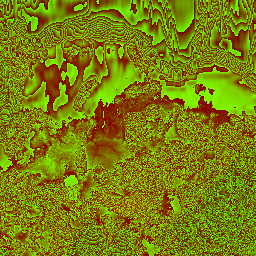</div>
<div>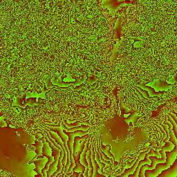</div>
<div>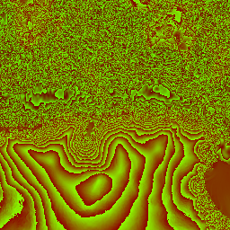</div>
</div>
<div style="font-size:0.85rem;color:#64748b;margin-top:4px;">Terrarium (elevation) — Zoom 1 (2×2)</div>
</div>
</div>

#### Ground Resolution per Zoom Level

Since every tile is 256 × 256 pixels, the ground distance per pixel depends on how many tiles the world is divided into:

```
Ground per pixel = 40,075 km ÷ (256 × 2ᶻ)
```

| Zoom | Calculation | Ground per pixel | Covers roughly |
|:---:|:---|---:|:---|
| 0 | 40,075 ÷ (256 × 2⁰) = 40,075 ÷ 256 | 156.5 km | Paris → London |
| 1 | 40,075 ÷ (256 × 2¹) = 40,075 ÷ 512 | 78.3 km | Stuttgart → Ulm |
| 2 | 40,075 ÷ (256 × 2²) = 40,075 ÷ 1,024 | 39.1 km | Stuttgart → Tübingen |
| 3 | 40,075 ÷ (256 × 2³) = 40,075 ÷ 2,048 | 19.6 km | Greater Stuttgart |
| 4 | 40,075 ÷ (256 × 2⁴) = 40,075 ÷ 4,096 | 9.8 km | Half of Stuttgart |
| 8 | 40,075 ÷ (256 × 2⁸) = 40,075 ÷ 65,536 | 611 m | A neighbourhood |
| 11 | 40,075 ÷ (256 × 2¹¹) = 40,075 ÷ 524,288 | 76.4 m | A city block |
| 13 | 40,075 ÷ (256 × 2¹³) = 40,075 ÷ 2,097,152 | 19.1 m | A building |
| 14 | 40,075 ÷ (256 × 2¹⁴) = 40,075 ÷ 4,194,304 | 9.6 m | A room |
| 15 | 40,075 ÷ (256 × 2¹⁵) = 40,075 ÷ 8,388,608 | 4.8 m | A car |

The original Shuttle Radar Topography Mission (SRTM) source data has a native resolution of approximately 30 m (1 arc-second). This means zoom 13 (~19 m/px) is the sweet spot — close to the native precision of the data. Higher zoom levels interpolate, while lower zoom levels average millions of measurements into a single pixel.

#### What is an Arc-Second?

Angles — like coordinates — are subdivided the same way as time:

| Unit | Definition | As degrees |
|---|---|---|
| 1 degree | base unit | 1° |
| 1 arc-minute | 1/60 of a degree | 0.0167° |
| 1 arc-second | 1/60 of an arc-minute | 0.000278° |

At the equator, one arc-second translates to:

```
x = 6,371 km × sin(1/3600°) ≈ 30.87 m
```

This is the native resolution of SRTM — one elevation sample approximately every 30 metres.

### Finding the Right Pixel: Latitude & Longitude to Tiles

The coordinates (latitude and longitude) are not stored in the pixels. Instead, they are calculated purely mathematically using the Mercator projection (EPSG:3857).

The entire map of the Earth is projected onto a massive square. The reference point `(0, 0)` is always the top-left corner of this square (which corresponds to the far north-west: 180° West, ~85.0511° North).

From there, the grid works like a coordinate system:
- X-axis (Longitude): Moves left to right (West to East). This is a simple linear mapping from −180° to +180°.
- Y-axis (Latitude): Moves top to bottom (North to South). Because the Mercator projection stretches the poles, this mapping is non-linear (it uses trigonometric functions).

At any zoom level `z`, the world is divided into a grid of `2ᶻ × 2ᶻ` tiles. 

#### The Math

To find which tile contains a specific coordinate, we use these formulas:

```cpp
// Longitude to X (Linear)
int x = std::floor((longitude + 180.0) / 360.0 * std::pow(2.0, zoom));

// Latitude to Y (Non-Linear Mercator)
double latRad = latitude * M_PI / 180.0;
int y = std::floor(
    (1.0 - std::log(std::tan(latRad) + 1.0 / std::cos(latRad)) / M_PI) / 2.0 * std::pow(2.0, zoom)
);
```

#### Example Visualization Tile - Stuttgart

To get a better understanding of how the Mercator projection works, let's visualize how the entire Earth maps onto the Zoom 0 tile, and how we find Stuttgart's position within it:

Stuttgart coordinates: 
```
48.78° N, 9.18° E (Decimal Degrees)
```

> [!WARNING]  
> Under Construction  
> The mercator projection and exploration I am currently working on. So stay tuned ;-).


<div style="display:flex;gap:32px;align-items:flex-start;flex-wrap:wrap;margin:2rem 0;">
<div style="flex:1;min-width:320px;text-align:center;">
<div style="font-weight:600;margin-bottom:12px;color:#334155;">Calculated Projection (SVG)</div>
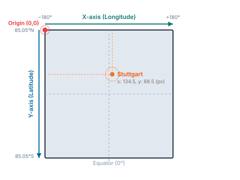
</div>

<div style="flex:1;min-width:320px;text-align:center;">
<div style="font-weight:600;margin-bottom:12px;color:#334155;">Raw Map Verification</div>
<div style="position:relative;width:256px;height:256px;border:1px solid #cbd5e1;margin:0 auto;box-shadow:0 1px 3px rgba(0,0,0,0.1);background-color:#e2e8f0;">

<!-- Vertical cross line -->
<div style="position:absolute;left:134.5px;top:0;width:1px;height:256px;background-color:rgba(71,85,105,0.7);box-shadow:0 0 2px rgba(255,255,255,0.5);"></div>
<!-- Horizontal cross line -->
<div style="position:absolute;left:0;top:88.5px;width:256px;height:1px;background-color:rgba(71,85,105,0.7);box-shadow:0 0 2px rgba(255,255,255,0.5);"></div>
<!-- Center dot -->
<div style="position:absolute;left:132.5px;top:86.5px;width:5px;height:5px;background-color:#ef4444;border-radius:50%;box-shadow:0 0 0 1px white;"></div>
</div>
<div style="font-size:0.85rem;color:#64748b;margin-top:12px;">
Crosshair placed mathematically at x: 134.5, y: 88.5
</div>
</div>
</div>

#### From Tile to Exact Pixel

The best way to think about the formulas is that they calculate your x/y position.

Let's look at a coordinate that computes to `x = 1076.45`. This single decimal number actually gives us two completely different pieces of information:

1. The Whole Number (`1076`) tells us WHICH file to download.
   Because tiles are distinct images on a server, we need whole numbers to request them (e.g., `https://.../11/1076/...`). The `1076` means "skip the first 1,076 tiles starting from the left edge of the map."

2. The Fraction (`0.45`) tells us WHERE we are inside that specific file.
   Once you download the tile `1076`, you have an image that might cover several square kilometres. But where exactly is your coordinate inside that image? The fraction `0.45` means you are 45% of the way across the tile. 

Because every tile is exactly 256 pixels wide, you take that percentage and multiply it by the width of the image:

`0.45 × 256 = 115.2`

This tells the computer: *"Open tile 1076, and look exactly at the 115th pixel from the left."* 

If we didn't use the fraction, we would only know *which* geographic tile we were in, but we would have no idea which of the 65,536 pixels inside that tile actually contained the elevation for our exact coordinate!


## Apply It

With this foundation in place, we can build an interactive terrain visualisation. Here is an example applied to the Stuttgart region.

The following website is 100% vibe coded. Claude is just impressive. The only thing I entered were some guardrails, ideas, specification. This is the result:

[Stuttgart Gradient Map →](stuttgart_gradient.html)

## References

- [NASA SRTM Digital Elevation Data](https://www.earthdata.nasa.gov/topics/land-surface/digital-elevation-terrain-model-dem)
- [Geographische Koordinaten — Wikipedia](https://de.wikipedia.org/wiki/Geographische_Koordinaten)
- [Fathom Global Terrain Data](https://www.fathom.global/product/fathomdem-global-terrain-data/)